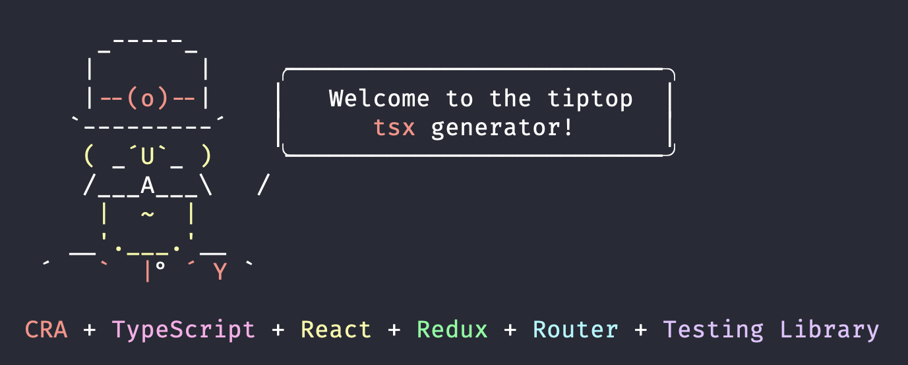

# TSX Yeoman Generator

<!-- prettier-ignore-start -->
<!-- markdownlint-disable -->

[](https://www.npmjs.org/package/generator-tsx)
[](https://www.npmjs.org/package/generator-tsx)
[](https://codecov.io/gh/adobe/generator-tsx)
[](https://greenkeeper.io/)
[](https://github.com/prettier/prettier)
[](https://app.netlify.com/sites/generator-tsx/deploys)
<!-- markdownlint-restore -->
<!-- prettier-ignore-end -->



## Goals

See [Design Goals](https://github.com/adobe/generator-tsx/wiki/Design-Goals).

## Features

- [TypeScript](http://www.typescriptlang.org/)
- [React](https://reactjs.org/)
  - [CRA](https://facebook.github.io/create-react-app/)
  - [Redux](https://react-redux.js.org/)
  - [Router](https://www.npmjs.com/package/@reach/router)
  - [Testing Library](https://github.com/testing-library/react-testing-library#react-testing-library)
  - [react-intl](https://github.com/formatjs/react-intl)
- CSS in JS via [Linaria](https://linaria.now.sh/)

## Configuration

Add the following
[GitHub secrets](https://help.github.com/en/articles/virtual-environments-for-github-actions#creating-and-using-secrets-encrypted-variables)
to your repo:

- `CODECOV_TOKEN`
- `NPM_TOKEN`

## Installation

First, install [Yeoman](http://yeoman.io) and generator-tsx using
[npm](https://www.npmjs.com/) (we assume you have pre-installed
[Node.js](https://nodejs.org/)).

```bash
npm install -g yo generator-tsx
```

Next, create a new folder for your project:

```bash
mkdir project-x
cd project-x
```

Finally, run the tsx generator to create your initial project files:

```bash
yo tsx [<appname>] [<version>] [options]
```

Project files are generated in the `project-x` directory.

Run `yo tsx --help` for more information about arguments and options.

## Sub-generators

All generators create project files including tests.

- [tsx:actions](#actions)
- [tsx:api](#api)
- [tsx:component](#component)
- [tsx:helper](#helper)
- [tsx:model](#model)
- [tsx:reducer](#reducer)
- [tsx:theme](#theme)
- [tsx:util](#util)
- [tsx:actions](#actions)
- [tsx:actions](#actions)
- [tsx:actions](#actions)

### actions

```bash
yo tsx:actions foo
```

Creates [Redux Actions](https://redux.js.org/basics/actions) in
`src/actions/foo/*`.

_This action also modifies `src/actions/index.ts`._

### api

```bash
yo tsx:api foo
```

Creates an API client in `src/api/foo/*`.

### component

```bash
yo tsx:component Foo [--connect]
```

Creates a [React Component](https://reactjs.org/docs/components-and-props.html)
as a simple function in `src/components/Foo/*`.

### helper

```bash
yo tsx:helper foo
```

Creates a helper function named `foo` and places it in `src/helpers/foo.ts`
(supports slashes in the name for folder depth).

### model

```bash
yo tsx:model Foo
```

Creates a model, defined as a
[TypeScript Interface](http://www.typescriptlang.org/docs/handbook/interfaces.html),
in `src/models/Foo.ts`.

### reducer

```bash
yo tsx:reducer foo
```

Creates a [Redux Reducer](https://redux.js.org/basics/reducers) in
`src/reducers/foo/*`.

### theme

```bash
yo tsx:theme foo
```

Creates a theme in `src/themes/foo` that is modeled after your existing
`src/models/Theme.ts` interface.

### util

```bash
yo tsx:util foo
```

Creates a utility function named `foo` and places it in `src/utils/foo.ts`
(supports slashes in the name for folder depth).

## Roadmap

For details on our planned features and future direction, please refer to our
[roadmap](https://github.com/adobe/generator-tsx/wiki/Roadmap).

## Getting To Know Yeoman

- Yeoman has a heart of gold.
- Yeoman is a person with feelings and opinions, but is very easy to work with.
- Yeoman can be too opinionated at times but is easily convinced not to be.
- Feel free to [learn more about Yeoman](http://yeoman.io/).

### Contributing

Contributions are welcomed! Read the
[Contributing Guide](.github/CONTRIBUTING.md) for more information.

### Licensing

This project is licensed under the Apache V2 License. See [LICENSE](LICENSE) for
more information.
